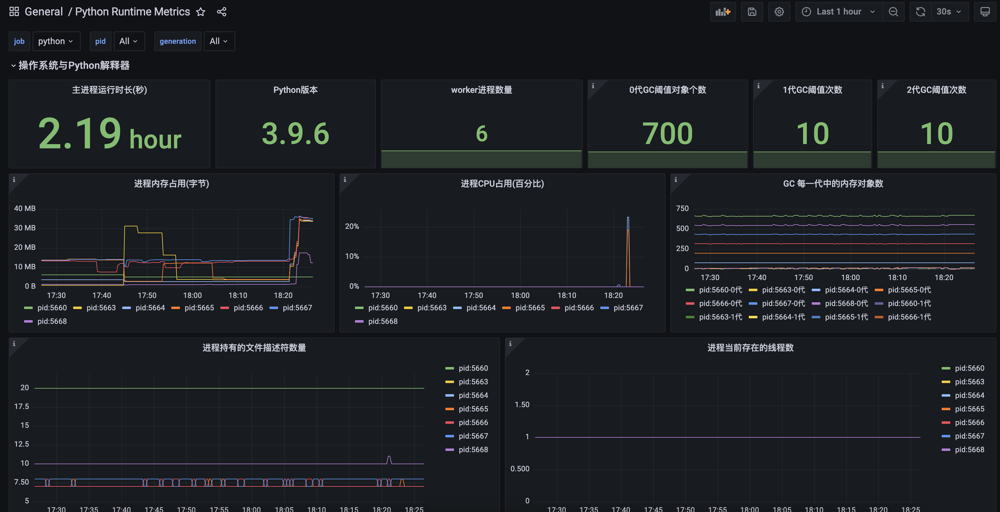

# prometheus-runtime-exporter
<a href="https://github.com/dream-mo/prometheus-runtime-exporter/blob/main/README_EN.md">English</a>

prometheus-runtime-exporter主要是为python runtime暴露相关的metric指标. 包括CPU使用情况、内存使用情况、GC情况、线程情况等等

支持Django、Flask框架适配, 同时兼容uwsgi运行方式,也可以正常采集指标数据

# 如何使用?
## 安装
```shell script
pip install prometheus-runtime-exporter
```
## 运行
psutil需要采集各个子进程的指标数据,需要root权限运行.
## 适配django
将metric()装配到django的url.py, 设置路径/metrics,即可访问此接口

```python
import psutil
from django.http import HttpResponse
from prometheus_runtime_exporter.exporter import RuntimeExporter


def metrics():
    """
    metrics api
    :return: 
    """
    p = psutil.Process()
    ppid = p.parent().pid
    children = psutil.Process(ppid).children()
    r = RuntimeExporter()
    for child in children:
        r.update(child.pid, "worker")
    r.update(ppid, "master")
    return HttpResponse(r.getMetricsContent(), content_type='text/plain;charset=utf-8')

```

## 适配flask
```python
from flask import Flask
from flask import Response
import psutil
from prometheus_runtime_exporter.exporter import RuntimeExporter

app = Flask(__name__)


@app.route("/metrics", methods=["GET"])
def metrics():
    """
    metrics api
    :return:
    """
    p = psutil.Process()
    ppid = p.parent().pid
    children = psutil.Process(ppid).children()
    r = RuntimeExporter()
    for child in children:
        r.update(child.pid, "worker")
    r.update(ppid, "master")
    return Response(r.getMetricsContent(), 200, mimetype='text/plain')


if __name__ == '__main__':
    app.run(host="0.0.0.0", port=8000)

```

# Grafana
## 截图



## JSON导入

查看docs/grafana-dashbord.json导入Grafana即可
