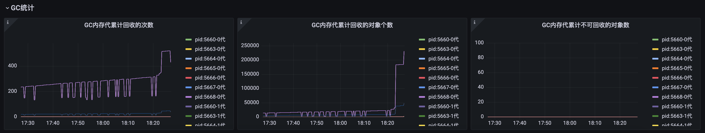

# prometheus-runtime-exporter
<a href="https://github.com/dream-mo/prometheus-runtime-exporter/blob/main/README.md">中文</a>

Prometheus runtime exporter mainly refers to metric indicators related to Python runtime exposure Including CPU usage, memory usage, GC situation, thread situation, etc

Supports Django and Flask framework adaptation, while also compatible with UWSGI runtime, and can collect indicator data normally

# How to use it?
## install
```shell script
pip install prometheus-runtime-exporter
```
## run
Psutil needs to collect indicator data for each sub process and requires root permission to run
## Adapt to Django
Assemble metric() to the URL. py of django, set the path/metrics to access this interface
```python
import psutil
from django.http import HttpResponse
from prometheus_runtime_exporter.exporter import RuntimeExporter


def metrics():
    """
    metrics api
    :return: 
    """
    p = psutil.Process()
    ppid = p.parent().pid
    children = psutil.Process(ppid).children()
    r = RuntimeExporter()
    for child in children:
        r.update(child.pid, "worker")
    r.update(ppid, "master")
    return HttpResponse(r.getMetricsContent(), content_type='text/plain;charset=utf-8')

```

## Adapt to Flask
```python
from flask import Flask
from flask import Response
import psutil
from prometheus_runtime_exporter.exporter import RuntimeExporter

app = Flask(__name__)


@app.route("/metrics", methods=["GET"])
def metrics():
    """
    metrics api
    :return:
    """
    p = psutil.Process()
    ppid = p.parent().pid
    children = psutil.Process(ppid).children()
    r = RuntimeExporter()
    for child in children:
        r.update(child.pid, "worker")
    r.update(ppid, "master")
    return Response(r.getMetricsContent(), 200, mimetype='text/plain')


if __name__ == '__main__':
    app.run(host="0.0.0.0", port=8000)

```

# Grafana
## screenshot




## JSON import

View docs/Grafana dashbord.json and import Grafana
